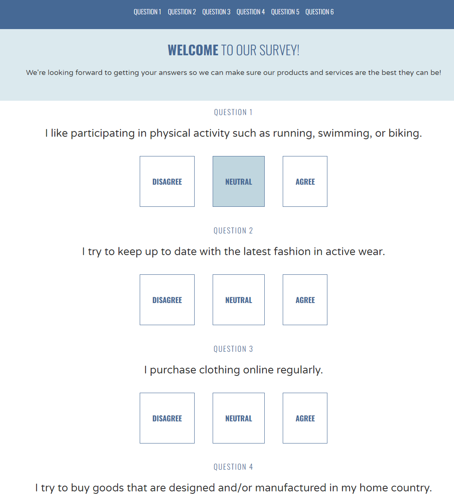

# CSS test from CodeCademy
Basic CSS Course - Creating a survey structure  
Need to do: 
- [x] Basic structure
- [ ] Add response to buttons (after mouse click)
- [ ] Improve readability
- [ ] Add option to send answers

# screenshot

